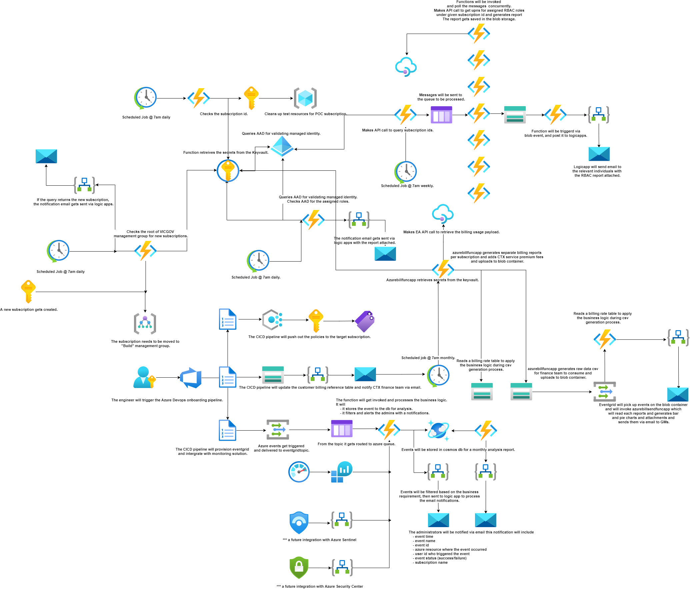

# VICGOV - Azure Alert, Monitor, Billing, Report Workflow
## 1. Introduction
### 1.1	Overview

As a result of needing to improve on cloud monitoring solution, Hosting Platform Services has been working to resolve number of issues and centralizing source of azure monitor via a workflow described in the diagram 2.1. 
 
This document is intended to provide a high level overview of workflow how the events captures and sends out the notifications. 
 
Included in this report is a step by step detailed guide around where to look for troubleshooting.

## 2 Logical Architecture
### 2.1	Logical System Component Overview
